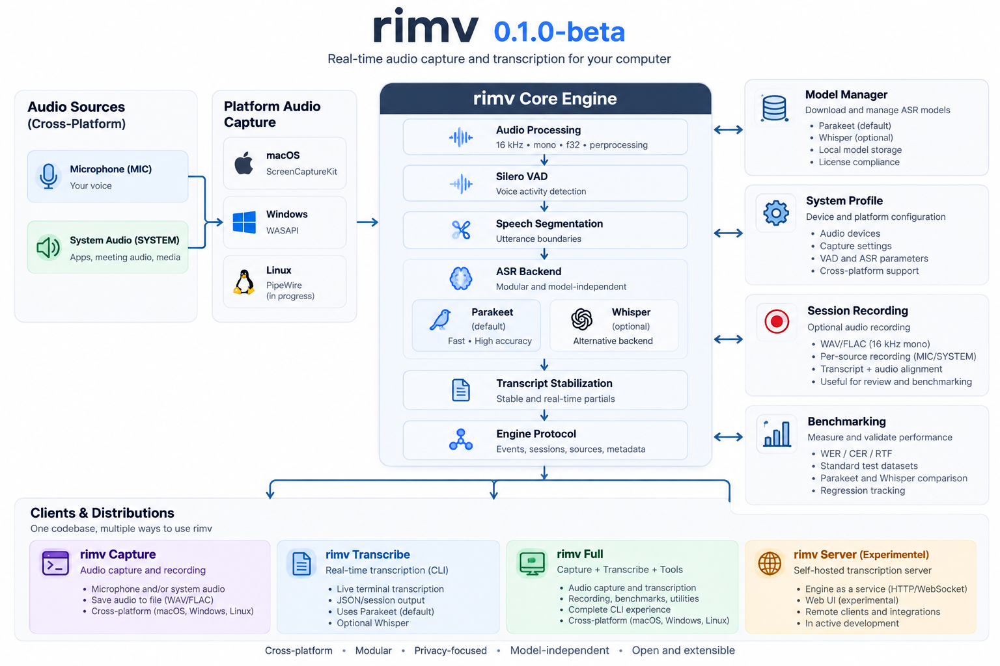

# rimv 0.1.0-beta

Real-time Intelligent Multilingual Voice

[](https://github.com/anthonywainer/rimv/releases)
[](https://www.rust-lang.org/)
[](LICENSE)
[](#platform-status)

rimv is a local Rust audio engine for capturing microphone and computer audio,
segmenting speech, and converting finalized speech to text. It is inspired by
`rimay`, a Quechua word associated with speaking and conversation.

This repository is preparing the first public beta release:

```text
v0.1.0-beta
```

macOS arm64 is the primary beta target. Windows and Linux remain first-class
architectural targets, but their runtime support is described below according to
what has actually been verified.

## What rimv Does

- Captures microphone audio.
- Captures system audio where the platform adapter supports it.
- Keeps microphone and system audio independent.
- Records audio before transcription, so recording can continue if VAD, ASR, or
  model loading fails.
- Uses bounded realtime queues between capture and speech work.
- Runs VAD/ASR outside capture callbacks.
- Emits finalized transcript segments and optional live partial updates.
- Provides a native macOS menu-bar app, CLI tools, an experimental local server,
  and a web UI preview.

The current transcription path uses Silero VAD plus Parakeet ASR through
`sherpa-onnx`. Parakeet recognition is currently run on finalized VAD segments;
this is realtime capture with segmented offline recognition, not true streaming
ASR.

## Quick Start

Choose the release asset that matches what you need:

| Asset | Use it when | Command included |
|---|---|---|
| **rimv Capture** | You only want to record microphone or supported system audio. It has no transcription runtime or models. | `rimv-capture` |
| **rimv Transcribe** | You want capture and speech-to-text. Download this for the commands below. ASR model files are installed separately. | `rimv` |
| **rimv Server (Experimental)** | You want the local `rimv serve` API for the experimental web UI. It is not a remote or production server. | `rimv` |

For the current beta, download the matching Transcribe asset and `SHA256SUMS`
from the GitHub Release. macOS arm64 uses `.tar.gz`; Windows x64 uses `.zip`.
Verify the download before extracting it:

```sh
shasum -a 256 -c SHA256SUMS
tar -xzf rimv-transcribe-<version>-macos-arm64.tar.gz
cd rimv-<version>-transcribe-macos-arm64
```

In PowerShell on Windows:

```powershell
Get-FileHash .\rimv-transcribe-<version>-windows-x64.zip -Algorithm SHA256
Expand-Archive .\rimv-transcribe-<version>-windows-x64.zip
Set-Location .\rimv-<version>-transcribe-windows-x64
```

Check that the bundled CLI runs:

```sh
./rimv --version
./rimv --help
./rimv doctor
./rimv models
```

`rimv Transcribe` requires local ASR model files before it can produce text.
Set `RIMV_PARAKEET_MODEL_DIR` to the Parakeet model directory and
`RIMV_SILERO_VAD_MODEL` to `silero_vad.onnx`, then confirm their paths with
`./rimv models`. See [Model Setup](#model-setup) for the full environment
variable examples.

Start listening with one source at a time, or both together:

```sh
./rimv listen --mic
./rimv listen --system
./rimv listen --both
```

On macOS, grant **Microphone** permission for microphone capture. For system
audio, also grant **Screen & System Audio Recording** in **System Settings →
Privacy & Security**. Quit and reopen rimv after changing a permission.

This beta publishes macOS arm64 artifacts and Windows x64 preview artifacts.
Model weights are not included, transcription is VAD-segmented rather than
true streaming ASR, and the Server and web UI remain experimental. Windows has
not yet been runtime-tested on hardware; Linux binaries are not public beta
downloads.

## Architecture



The main runtime boundaries are also summarized below for text-only readers:

```text
clients
  CLI / menu-bar app / experimental web UI
        |
engine-protocol
        |
engine-runtime
        |
microphone capture      system-audio capture
        |               |
bounded queues          bounded queues
        |               |
recording storage       VAD + ASR worker
```

Core crates and apps:

- `crates/audio-core`: portable audio frame/domain types and errors.
- `crates/audio-capture`: native microphone and system-audio adapters.
- `crates/engine-protocol`: commands, events, snapshots, capabilities, errors.
- `crates/engine-runtime`: capture lifecycle, sessions, storage, event bus.
- `crates/speech-transcription`: VAD, ASR backends, worker boundaries.
- `crates/model-manager`: local model catalog and model path resolution.
- `apps/capture-cli`: lightweight capture-only CLI.
- `apps/rimv-cli`: main developer CLI.
- `apps/menu-bar`: native macOS status-item app.
- `apps/web`: experimental web UI.

## Distributions

All beta distributions come from the same repository, engine, and version.

| Distribution | Contents | Beta status |
|---|---|---|
| rimv Capture | `rimv-capture`, capture runtime, no ASR/model manager/model weights | Staged locally on macOS arm64 |
| rimv Transcribe | `rimv`, capture, VAD, ASR runtime, model manager, native ASR libraries | Staged locally on macOS arm64; model weights installed separately |
| rimv Server | `rimv serve`, same runtime libraries as Transcribe | Experimental; binds to `127.0.0.1` by default |
| rimv Full | Ready-to-use Transcribe with bundled model weights | Omitted from this beta until third-party model redistribution terms are verified |

Model weights are not bundled in the beta staging output.

## Platform Status

| Platform | Build status | Runtime capture | Transcription | Release status |
|---|---|---|---|---|
| macOS arm64 | Verified locally | Microphone and ScreenCaptureKit system capture have been exercised on this host | Parakeet path has been exercised on this host | Primary beta target |
| Windows x64 | Release build configured | Microphone and WASAPI loopback adapter exist in code, but were not runtime-tested on Windows hardware | Not runtime-tested | Preview public beta artifact |
| Linux x64 | Scheduled/manual validation configured | Microphone uses CPAL/ALSA; system capture is explicitly unsupported pending PipeWire | Not runtime-tested | Experimental/partial; no public beta binary |

Compilation alone does not mean runtime support. Hardware and permission-based
capture tests must be run on each target operating system before promoting that
target beyond Preview.

## Requirements

- Rust toolchain.
- macOS 13+ and Xcode command line tools for the macOS menu-bar app and
  ScreenCaptureKit system capture.
- Node.js/npm for the web UI.
- Local model files for transcription.
- macOS permissions when using microphone or system audio:
  - Microphone
  - Privacy & Security -> Screen & System Audio Recording

This repository has local Makefile helpers that use the project-local Rust
toolchain under `.rust-tools` when available.

## Build And Check

```sh
make check
```

This runs the standard local validation:

```sh
cargo fmt --all -- --check
cargo check --workspace --locked
cargo clippy --workspace --all-targets --locked -- -D warnings
cargo test --workspace --locked
```

Run only the strict Rust lint gate:

```sh
make lint
```

To lint Linux-specific code locally, start Docker Desktop and run:

```sh
make lint-linux-docker
```

Windows-specific compilation and WASAPI behavior still require a Windows VM,
physical Windows machine, or the GitHub Actions Windows runner.

Build the main CLI:

```sh
make rimv
```

Build and open the macOS menu-bar app:

```sh
make menu
```

Build the web UI:

```sh
cd apps/web
npm ci
npm run build
```

Run the web UI locally:

```sh
cd apps/web
npm run dev
```

The web UI is experimental. It needs the local rimv server to control the Rust
runtime:

```sh
make app-web
```

## CLI Quick Start

Show the main CLI help:

```sh
make rimv
```

List devices and model state:

```sh
make rimv-devices
make rimv-models
```

Download the development models into the Git-ignored `resources/models/` tree:

```sh
make models
```

Listen to microphone audio with live partials and metrics:

```sh
make rimv-listen
```

Listen to microphone and system audio together in Spanish:

```sh
make rimv-listen-es
```

Equivalent direct command when your shell already has model paths configured:

```sh
cargo run -p rimv -- listen --both --language es --show-partials --show-metrics
```

Transcribe a local file:

```sh
cargo run -p rimv -- transcribe --model /path/to/parakeet-model-dir input.mp3
```

Start the experimental localhost server:

```sh
cargo run -p rimv -- serve --host 127.0.0.1 --port 7878
```

Language defaults to `auto`. The CLI accepts both `--language es` and
`--lang es`.

## Model Setup

Development helpers install models under:

```text
resources/models/
```

That directory is intentionally ignored by Git. In a normal user installation,
rimv can use:

```text
~/Library/Application Support/rimv/models/
```

You can override model discovery with:

```sh
export RIMV_MODELS_DIR=/path/to/models
export RIMV_PARAKEET_MODEL_DIR=/path/to/parakeet-model-dir
export RIMV_SILERO_VAD_MODEL=/path/to/silero_vad.onnx
```

`rimv models` reports model catalog entries, required files, local state, and
supported language codes.

## Packaging

Phase 2 added staging scripts for the beta distribution shapes:

```sh
make stage-capture
make stage-transcribe
make stage-server
```

The staged output is written under:

```text
target/distributions/
```

`make stage-full` intentionally fails for `0.1.0-beta` because model-weight
redistribution has not been verified.

## Release Pipeline

`.github/workflows/release.yml` validates release tags, runs one locked Linux
quality gate for the exact tagged commit, then builds and archives macOS arm64
and Windows x64 beta packages, inspects archive contents, generates
`SHA256SUMS`, and publishes a GitHub Release only for tag pushes. Windows is a
preview release target; Linux remains a scheduled/manual validation target and
does not publish beta artifacts. Manual `workflow_dispatch` runs are dry runs:
they build and upload workflow artifacts but do not publish a GitHub Release.

For `v0.1.0-beta`, the public release attaches:

```text
rimv-capture-v0.1.0-beta-macos-arm64.tar.gz
rimv-transcribe-v0.1.0-beta-macos-arm64.tar.gz
rimv-server-v0.1.0-beta-macos-arm64.tar.gz
rimv-capture-v0.1.0-beta-windows-x64.zip
rimv-transcribe-v0.1.0-beta-windows-x64.zip
rimv-server-v0.1.0-beta-windows-x64.zip
SHA256SUMS
```

The archive script derives the version from the release tag. Windows artifacts
are preview builds; Linux equivalents remain deferred until runtime validation.

Trigger the beta release after validation and owner approval with:

```sh
git tag v0.1.0-beta
git push origin v0.1.0-beta
```

## Benchmark Note

Benchmarks are local tools for evaluating this repository, not universal
performance claims. One pre-beta internal `realtime_capture` case measured:

| Metric | Result |
|---|---:|
| WER | 0.112 |
| CER | 0.127 |
| RTF | 0.028 |
| Cases | 1 |

These numbers describe one internal case only. They should not be used as a
cross-platform performance guarantee.

Run local benchmarks with:

```sh
cargo run -p rimv -- benchmark --mode direct-file --model /path/to/parakeet-model-dir
cargo run -p rimv -- benchmark --mode realtime-capture --model /path/to/parakeet-model-dir
```

`realtime-capture` is macOS-only because it uses ScreenCaptureKit and
`/usr/bin/afplay`.

## Server And Web Security

`rimv serve` is experimental and binds to `127.0.0.1` by default. Treat the web
UI as a local development preview, not a finished remote-control product. LAN or
remote access must be an explicit future choice with authentication and a clear
security model.

## Unsigned macOS Builds

Free community builds are unsigned or ad-hoc signed and are not notarized. They
are suitable for testing and development, and may be blocked by Gatekeeper.

To open a downloaded community build safely:

1. Move the app to Applications.
2. Control-click the app.
3. Choose Open.
4. Confirm Open in the macOS prompt.

Do not globally disable Gatekeeper.

Future signed releases can add Developer ID signing, notarization, and stapling.
That requires a paid Apple Developer account and is not required for the free
beta release flow.

## Known Limitations

- Transcription is VAD-segmented recognition, not true streaming ASR.
- Model weights are installed separately and are not bundled in beta artifacts.
- rimv Full is omitted until redistribution terms are verified for all bundled
  model files.
- Windows and Linux are not yet runtime-validated for the full capture and
  transcription path.
- Linux system audio capture is not implemented yet.
- The web UI and server are experimental.
- macOS audio permissions are granted per launcher or app bundle. If permissions
  change, quit and reopen the app before testing again.

## Roadmap

- Add CI coverage across macOS, Windows, and Linux.
- Runtime-test Windows microphone, WASAPI loopback, and transcription.
- Add Linux PipeWire system capture.
- Decide whether rimv Full can bundle model weights after verifying
  redistribution terms and attribution.
- Harden the server/web surface before any non-local use.

## License

See [LICENSE](LICENSE).
